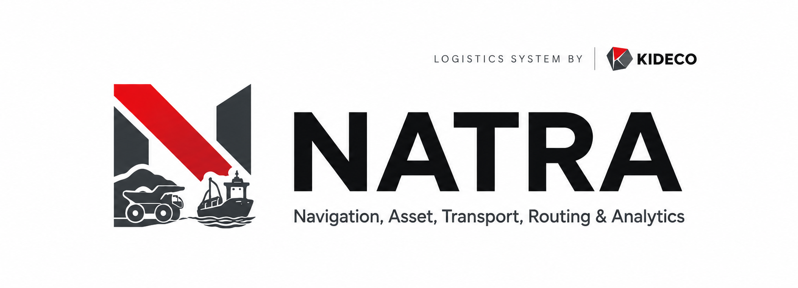
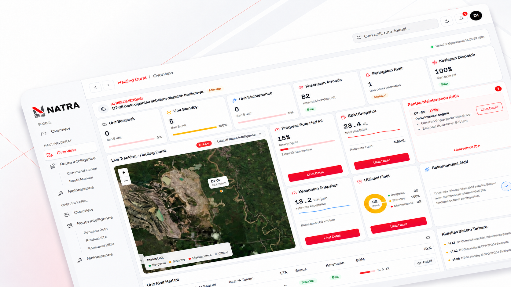

<div align="center">
  
</div>

<p align="center">
  <br/>
  <strong>NATRA</strong> &mdash; <em>Navigation, Asset, Transport, Routing & Analytics</em>
  <br/>
  Real-time hauling logistics decision support for modern mining operations.
  <br/><br/>
</p>

<div align="center">

[](https://github.com/kideco-juara-hackathon/kideco-natra)
[](https://github.com/kideco-juara-hackathon/kideco-natra)
[](https://nextjs.org)
[](https://fastapi.tiangolo.com)
[](LICENSE)

</div>

---

<br/>

<div align="center">
  
  <br/>
  <sub><em>NATRA Hauling Dashboard — Live fleet tracking, route intelligence, and predictive analytics in one view.</em></sub>
</div>

<br/>

---

## What is NATRA?

NATRA is an integrated hauling logistics control platform built for mining dispatchers. It combines Dijkstra-based route optimization, ML-powered ETA & fuel prediction, real-time fleet health monitoring, and live vehicle telemetry — all in a single, purpose-built dashboard.

> Built for the **KIC 2026 Hackathon** · Kideco Jaya Agung

---

## Features

<table>
  <tr>
    <td width="50%" valign="top">
      <h3>🗺️&nbsp; Route Intelligence</h3>
      <p>Optimal route recommendations powered by Dijkstra with multi-metric comparison — ETA, fuel consumption, payload, queue time, and road risk. Dispatchers choose between <em>Balanced</em>, <em>Fuel-Efficient</em>, or <em>Low-Queue</em> strategies.</p>
    </td>
    <td width="50%" valign="top">
      <h3>📡&nbsp; Command Center</h3>
      <p>Real-time fleet monitoring with an interactive map, live vehicle positions, per-truck telemetry panels, and integrated alert notifications — all updating every 2 seconds from the backend.</p>
    </td>
  </tr>
  <tr>
    <td width="50%" valign="top">
      <h3>🔧&nbsp; Predictive Maintenance</h3>
      <p>ML-powered health scoring using an <strong>IsolationForest</strong> model trained on 6 sensor streams: RPM, oil pressure, coolant temperature, fuel pressure, coolant pressure, and lube oil temperature. Health scores update on every telemetry tick.</p>
    </td>
    <td width="50%" valign="top">
      <h3>⚡&nbsp; ETA & Fuel Prediction</h3>
      <p><strong>RandomForest</strong> (ETA) and <strong>XGBoost</strong> (fuel) models wired into the prediction engine, with physics-based rule fallback. Predictions are computed per route segment and aggregated for full-trip estimates.</p>
    </td>
  </tr>
  <tr>
    <td width="50%" valign="top">
      <h3>📊&nbsp; Route Monitor</h3>
      <p>Live tabular view of all active trips across three lenses — Overview, ETA, and Fuel — with a slide-in detail panel per truck showing health score, trip progress, and segment-level telemetry history.</p>
    </td>
    <td width="50%" valign="top">
      <h3>🚛&nbsp; Fleet Management</h3>
      <p>Full shift lifecycle: start shift, assign trucks, dispatch to loading points, track trip progress, and monitor accumulated engine hours for wear-out detection across the entire fleet.</p>
    </td>
  </tr>
</table>

---

## Dispatcher Workflow

```
Dispatcher selects truck & destination
            ↓
Backend loads road network nodes and edges
            ↓
Route engine recommends optimal path (Dijkstra)
            ↓
ML models compute ETA / fuel / health score
            ↓
Dispatcher reviews recommendations & dispatches trip
            ↓
Command Center monitors progress & live telemetry
```

---

## Fleet

<div align="center">
  
  &nbsp;&nbsp;&nbsp;&nbsp;
  
  <br/>
  <sub>Dump Truck &nbsp;&nbsp;&nbsp;&nbsp;&nbsp;&nbsp;&nbsp;&nbsp;&nbsp;&nbsp;&nbsp;&nbsp;&nbsp;&nbsp;&nbsp;&nbsp;&nbsp;&nbsp;&nbsp;&nbsp;&nbsp;&nbsp;&nbsp;&nbsp;&nbsp;&nbsp; Loader</sub>
</div>

---

## Tech Stack

| Layer | Technology |
|---|---|
| **Frontend** | Next.js 16 (React 19), TypeScript, Tailwind CSS 4 |
| **UI Components** | Shadcn/ui, Base UI, Lucide React |
| **Visualization** | Recharts, Leaflet / react-leaflet |
| **Backend** | FastAPI 0.115, Python 3.12 |
| **ML Models** | scikit-learn (IsolationForest), XGBoost, RandomForest |
| **Database** | PostgreSQL 16, SQLAlchemy 2.0, Alembic |
| **Simulator** | Python async HTTP telemetry simulator |
| **Infrastructure** | Docker Compose, Uvicorn ASGI |

---

## Quick Start

### Prerequisites

- Node.js 20+, Python 3.12+, Docker & Docker Compose

### Frontend

```bash
cd frontend
npm install
npm run dev
# → http://localhost:3000
```

### Backend (Docker — recommended)

```bash
docker compose up --build
# API  → http://localhost:8000
# Docs → http://localhost:8000/docs
```

### Backend (local)

```bash
cd backend
pip install -r requirements.txt
alembic upgrade head
uvicorn app.main:app --reload
```

### Telemetry Simulator

```bash
cd simulator
pip install -r requirements.txt

python telemetry_simulator.py                        # normal scenario
python telemetry_simulator.py --scenario degraded    # gradual engine degradation on DT-03
python telemetry_simulator.py --scenario breakdown   # critical failure scenario on DT-03
python telemetry_simulator.py --speed fast           # compress trip duration to ~90s
```

---

## Repository Structure

```
kideco-main/
├── frontend/     # Next.js dispatcher dashboard
├── backend/      # FastAPI — routes, telemetry, ML health scoring
├── simulator/    # Async vehicle telemetry simulator
├── docs/         # Architecture, API contract, data contract
└── docker-compose.yml
```

---

## Documentation

| Document | Description |
|---|---|
| [`docs/architecture.md`](docs/architecture.md) | MVP architecture and technical decisions |
| [`docs/api-contract.md`](docs/api-contract.md) | Full API endpoint specification |
| [`docs/data-contract.md`](docs/data-contract.md) | Data models and schemas |
| [`docs/route-optimization.md`](docs/route-optimization.md) | Route optimization algorithm |
| [`docs/ml-eta.md`](docs/ml-eta.md) | ETA prediction model experiments |
| [`docs/simulator.md`](docs/simulator.md) | Telemetry simulator scenarios |

---

<div align="center">
  <br/>
  
  <br/><br/>
  <sub>Built with ❤️ for <strong>KIC 2026 Hackathon</strong> · Kideco Jaya Agung</sub>
  <br/>
  <sub>
    <a href="https://github.com/kideco-juara-hackathon/kideco-natra">GitHub</a>
  </sub>
  <br/><br/>
</div>
