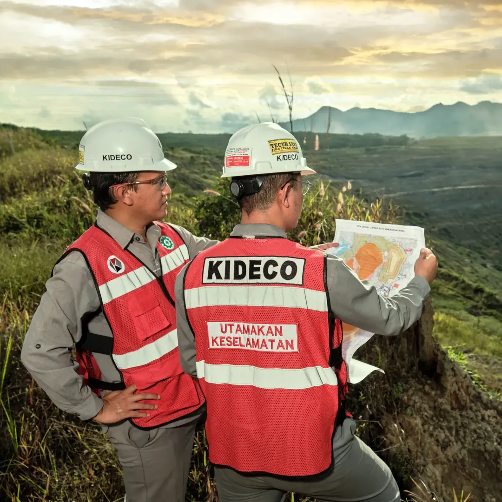

<div align="center">
  

  <p><strong>Sistem pendukung keputusan logistik hauling real-time untuk operasi pertambangan.</strong></p>

  <p>
    
    
    
    
    
  </p>

  <p>
    
    
  </p>
</div>

---

## Apa itu NATRA?

**NATRA** (*Navigation, Asset, Transport, Routing & Analytics*) adalah platform kontrol logistik hauling terintegrasi yang dirancang untuk dispatcher operasi pertambangan. NATRA menggabungkan rekomendasi rute berbasis algoritma Dijkstra, prediksi ETA & konsumsi BBM, pemantauan kesehatan armada secara real-time, dan telemetri kendaraan dalam satu dashboard terpusat.

<div align="center">
  <table>
    <tr>
      <td align="center">
        <br />
        <sub><b>Hauling & Operations Control</b></sub>
      </td>
      <td align="center">
        <br />
        <sub><b>Jetty Command Center</b></sub>
      </td>
      <td align="center">
        <br />
        <sub><b>Route Intelligence</b></sub>
      </td>
    </tr>
  </table>
</div>

---

## Fitur Utama

<table>
  <tr>
    <td width="50%">
      <h3>🗺️ Route Intelligence</h3>
      <p>Rekomendasi rute optimal berbasis Dijkstra dengan perbandingan multi-metrik: ETA, konsumsi BBM, payload, antrean, dan risiko jalan. Dispatcher dapat memilih antara opsi Seimbang, Hemat BBM, atau Antrian Rendah.</p>
    </td>
    <td width="50%">
      <h3>📡 Command Center</h3>
      <p>Monitoring armada real-time dengan peta interaktif, status posisi kendaraan, panel telemetri langsung, dan sistem notifikasi peringatan terintegrasi.</p>
    </td>
  </tr>
  <tr>
    <td width="50%">
      <h3>🔧 Maintenance Intelligence</h3>
      <p>Pemantauan kesehatan armada dengan skor kesehatan, tren suhu mesin, tekanan oli, getaran RMS, dan rekomendasi tindakan prioritas berdasarkan tingkat risiko.</p>
    </td>
    <td width="50%">
      <h3>⚡ Prediksi ETA & BBM</h3>
      <p>Estimasi berbasis aturan untuk ETA segmen perjalanan (kosong & bermuatan), penalti lalu lintas, penalti payload, dan perkiraan konsumsi bahan bakar per trip.</p>
    </td>
  </tr>
</table>

---

## Alur Kerja Dispatcher

```
Dispatcher memilih kendaraan & tujuan
        ↓
Backend memuat node dan edge jaringan jalan
        ↓
Route engine merekomendasikan jalur optimal
        ↓
Sistem menghitung ETA / BBM / skor kesehatan
        ↓
Dispatcher meninjau rekomendasi & mendispatch trip
        ↓
Command Center memantau progres & telemetri real-time
```

---

## Armada

<div align="center">
  
  &nbsp;&nbsp;&nbsp;
  
</div>

<div align="center">
  <sub>Dump Truck &nbsp;&nbsp;&nbsp;&nbsp;&nbsp;&nbsp;&nbsp;&nbsp;&nbsp;&nbsp;&nbsp;&nbsp;&nbsp;&nbsp;&nbsp;&nbsp;&nbsp;&nbsp;&nbsp;&nbsp;&nbsp;&nbsp;&nbsp;&nbsp;&nbsp;&nbsp;&nbsp;&nbsp;&nbsp;&nbsp;&nbsp; Loader</sub>
</div>

---

## Tech Stack

| Layer | Teknologi |
|-------|-----------|
| **Frontend** | Next.js 16 (React 19), TypeScript, Tailwind CSS 4 |
| **Komponen UI** | Shadcn/ui, Base UI, Lucide React |
| **Visualisasi** | Recharts, Leaflet / react-leaflet |
| **Backend** | FastAPI 0.115, Python 3.12 |
| **Database** | PostgreSQL 16, SQLAlchemy 2.0, Alembic |
| **Simulator** | Telemetri HTTP berbasis Python |
| **Infra** | Docker Compose, Uvicorn ASGI |

---

## Struktur Repository

```
kideco-main/
├── frontend/        # Dashboard dispatcher Next.js
├── backend/         # FastAPI — rute, telemetri, health scoring
├── ml/              # Eksperimen model ETA
├── simulator/       # Simulator telemetri kendaraan
├── data/            # Seed data & sampel sanitasi
└── docs/            # Arsitektur, API contract, data contract
```

---

## Menjalankan Secara Lokal

### Prasyarat

- Node.js 20+
- Python 3.12+
- Docker & Docker Compose (opsional, untuk backend + DB)

### Frontend

```bash
cd frontend
npm install
npm run dev
# → http://localhost:3000
```

### Backend (dengan Docker)

```bash
docker compose up --build
# API  → http://localhost:8000
# Docs → http://localhost:8000/docs
# DB   → localhost:5432
```

Jika port `8000` sudah digunakan:

```bash
BACKEND_PORT=8002 docker compose up --build
```

### Backend (tanpa Docker)

```bash
cd backend
pip install -r requirements.txt
uvicorn app.main:app --reload
```

### Simulator Telemetri

```bash
cd simulator
pip install -r requirements.txt

# Skenario normal — semua truck sehat, trip berjalan mulus
python telemetry_simulator.py --scenario normal

# Skenario degraded — DT-03 menunjukkan kenaikan suhu mesin & getaran bertahap
python telemetry_simulator.py --scenario degraded

# Skenario breakdown — DT-03 health score jatuh kritis, memicu alert darurat
python telemetry_simulator.py --scenario breakdown

# Auto-dispatch: mulai shift & dispatch truck idle otomatis jika belum ada trip aktif
python telemetry_simulator.py --scenario normal --auto-dispatch

# Custom interval & backend URL
python telemetry_simulator.py --scenario degraded --interval 3 --backend http://localhost:8000
```

---

## Dokumentasi

| Dokumen | Deskripsi |
|---------|-----------|
| [`docs/architecture.md`](docs/architecture.md) | Arsitektur MVP dan keputusan teknis |
| [`docs/api-contract.md`](docs/api-contract.md) | Spesifikasi endpoint API lengkap |
| [`docs/data-contract.md`](docs/data-contract.md) | Model data dan skema |
| [`docs/route-optimization.md`](docs/route-optimization.md) | Algoritma optimasi rute |
| [`docs/ml-eta.md`](docs/ml-eta.md) | Eksperimen model prediksi ETA |
| [`docs/simulator.md`](docs/simulator.md) | Skenario simulator telemetri |

---

## Kebijakan Data

Jangan commit dataset internal pertambangan mentah kecuali tim memiliki izin eksplisit. Gunakan `data/seeds` untuk data simulasi yang telah disanitasi. Direktori `data/raw` hanya untuk penggunaan lokal dan tidak boleh di-commit.

---

<div align="center">
  
  <br />
  <sub>Dibangun untuk <strong>KIC 2026 Hackathon</strong> · Kideco Jaya Agung</sub>
</div>
